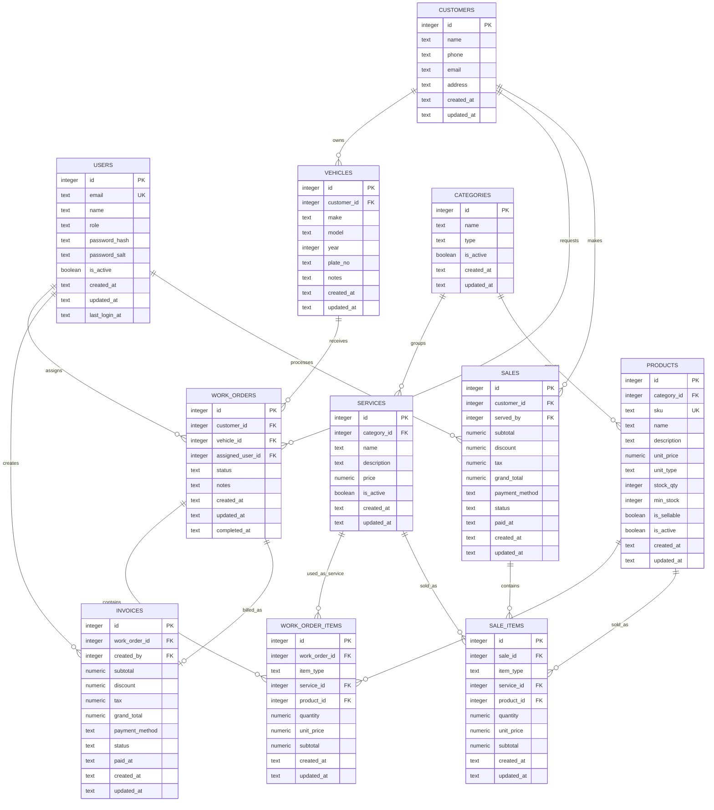
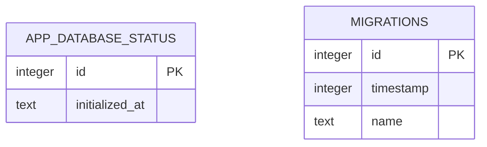

# SimplePOS ERD

This document describes the target domain model for the SimplePOS car repair shop POS and inventory app. The current implementation already has authentication/system tables; the wider POS and inventory tables are the planned app model.

## Domain ERD

## Relationship Summary

| From | To | Cardinality | Notes |
|---|---|---:|---|
| `customers` | `vehicles` | 1:N | A customer can own multiple vehicles. |
| `customers` | `work_orders` | 1:N | Work orders are tied to a customer. |
| `vehicles` | `work_orders` | 1:N | Each work order services one vehicle. |
| `users` | `work_orders` | 1:N | A user can be assigned to many work orders. |
| `work_orders` | `work_order_items` | 1:N | Items can be service lines or product/part lines. |
| `services` | `work_order_items` | 1:N | Used when `item_type = service`. |
| `products` | `work_order_items` | 1:N | Used when `item_type = product`. |
| `categories` | `services` | 1:N | Service category grouping. |
| `categories` | `products` | 1:N | Product/part category grouping. |
| `work_orders` | `invoices` | 1:0..1 | A completed work order can become one invoice. |
| `users` | `invoices` | 1:N | Invoice creator/cashier. |
| `users` | `sales` | 1:N | The staff member who processed the sale. |
| `customers` | `sales` | 1:N | Optional — walk-in sales may have no customer. |
| `sales` | `sale_items` | 1:N | Line items for each product or service sold. |
| `products` | `sale_items` | 1:N | Used when `item_type = product`. |
| `services` | `sale_items` | 1:N | Used when `item_type = service`. |

## Product Units And Pricing

Products are priced and stocked by unit type. For example, engine oil can use `unit_type = litre`, while an oil filter can use `unit_type = piece`.

| Field | Purpose |
|---|---|
| `unit_type` | Unit used for stock and sales quantity, such as `piece`, `litre`, `set`, or `box`. |
| `unit_price` | Sale price for one unit of the selected `unit_type`. |
| `stock_qty` | Current stock amount in the selected `unit_type`. |
| `min_stock` | Low-stock threshold in the selected `unit_type`. |

## System Tables

These tables support the Electron/TypeORM SQL.js implementation and are not part of the POS domain model.

