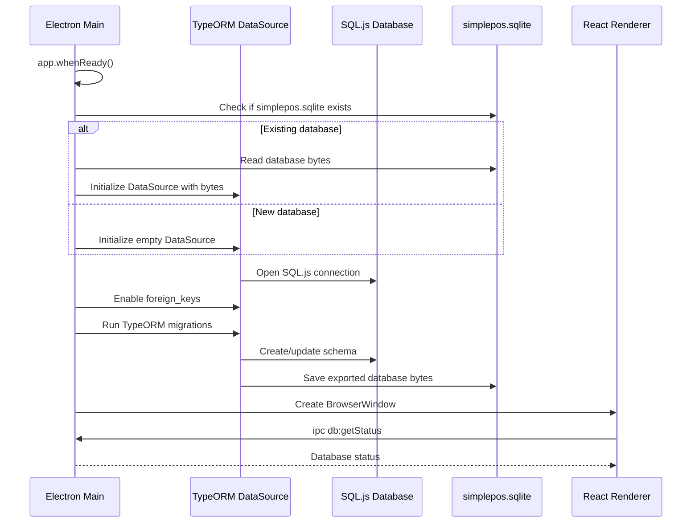
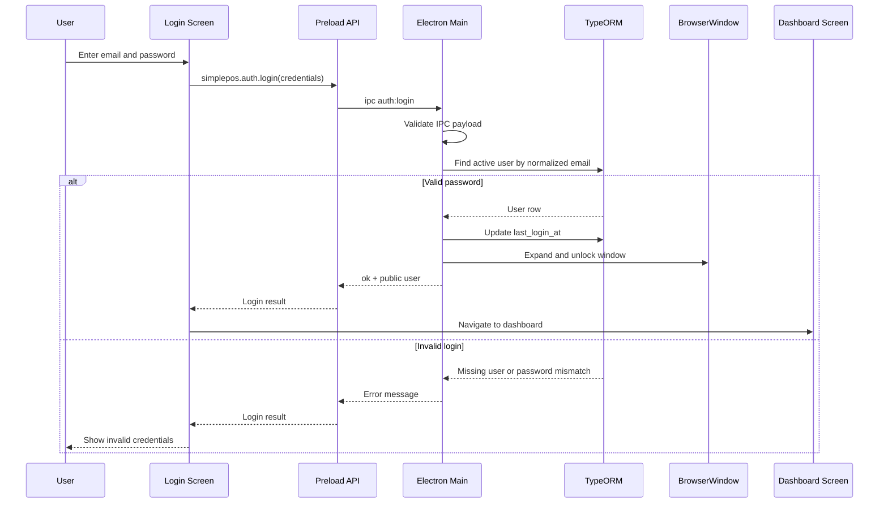
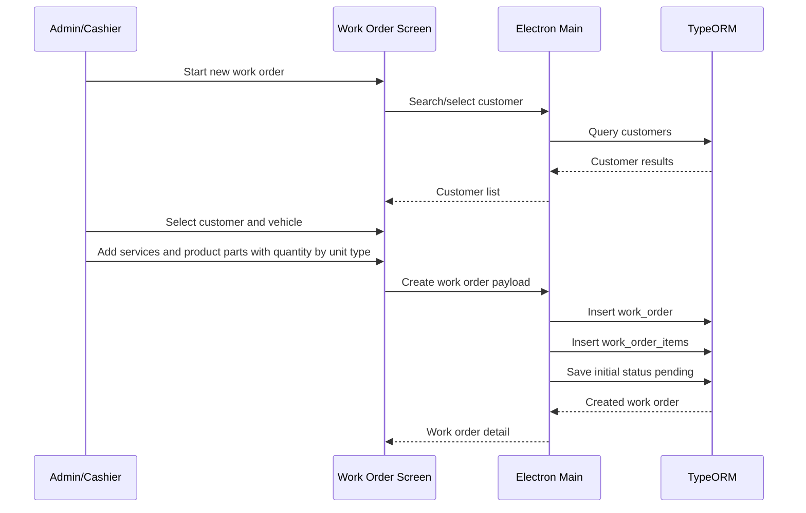
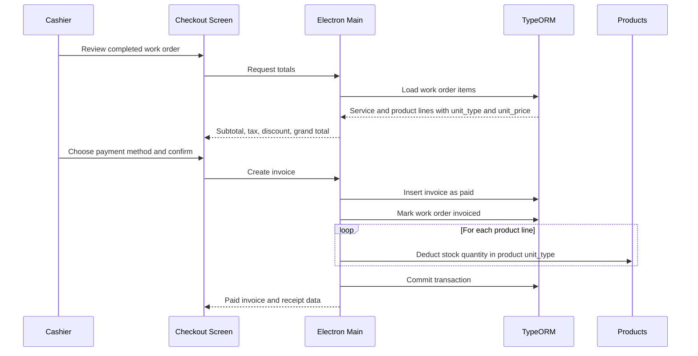
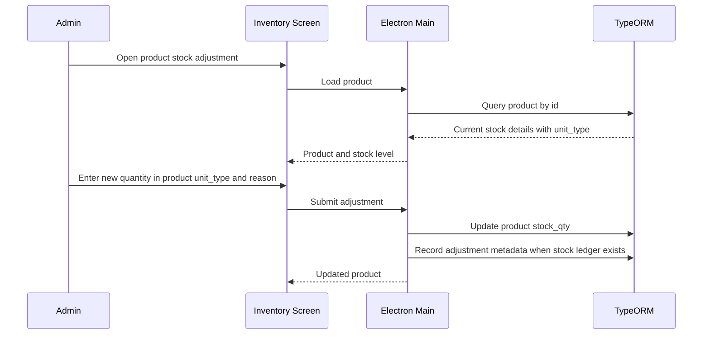

# SimplePOS Sequence Diagrams

These diagrams describe the current Electron/React database and login flow, plus planned SimplePOS POS and inventory workflows.

## App Startup And Database Initialization

## User Login

## Create Work Order

## Checkout And Inventory Deduction

## Stock Adjustment

