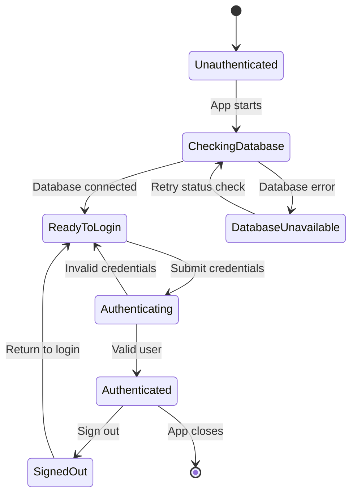
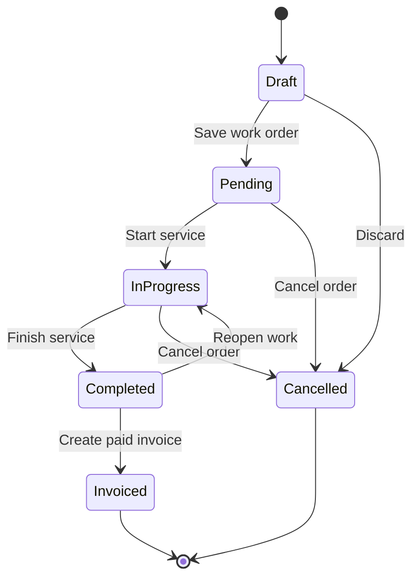
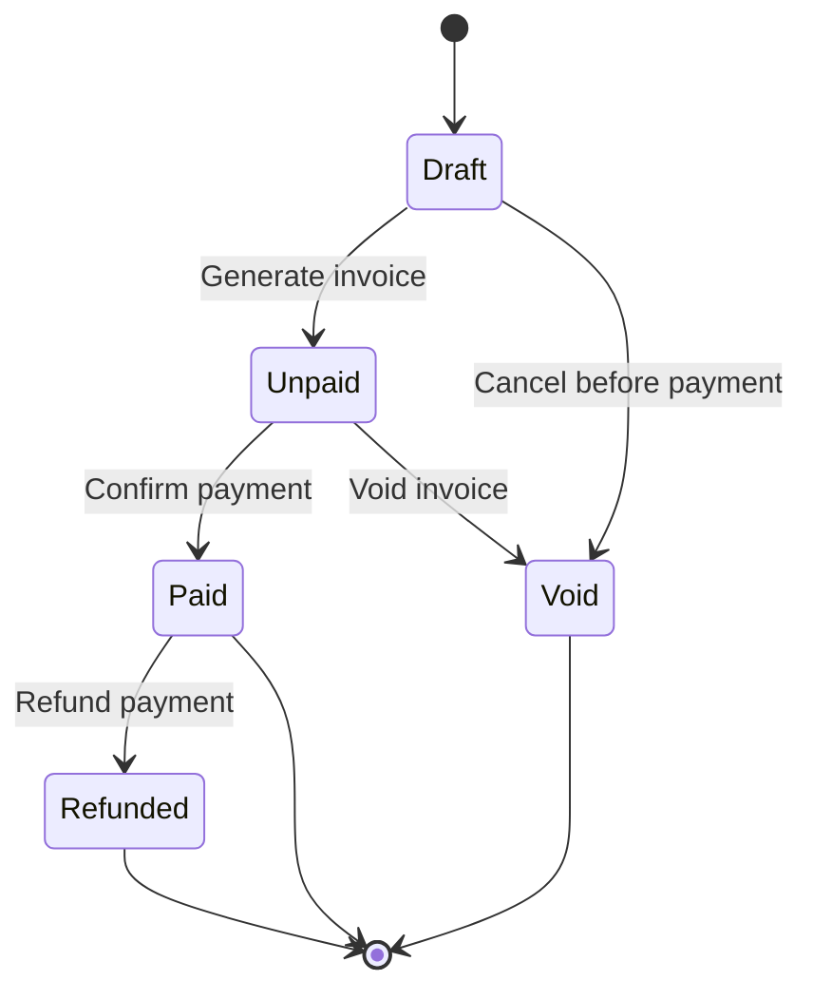
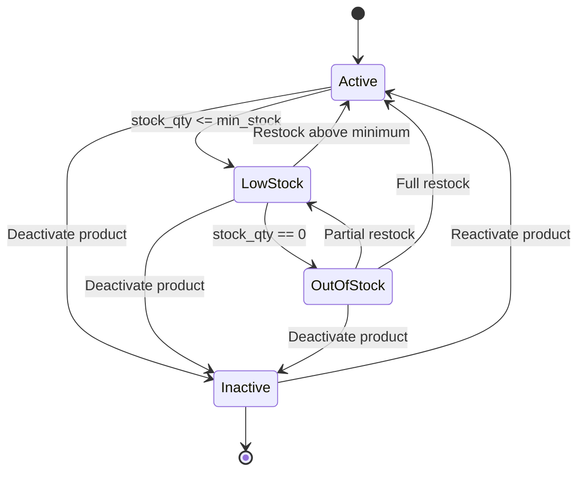

# SimplePOS State Diagrams

These state diagrams describe key UI and business lifecycles for the SimplePOS POS and inventory app.

## User Session State

## Work Order State

## Invoice And Payment State

## Inventory Item State

